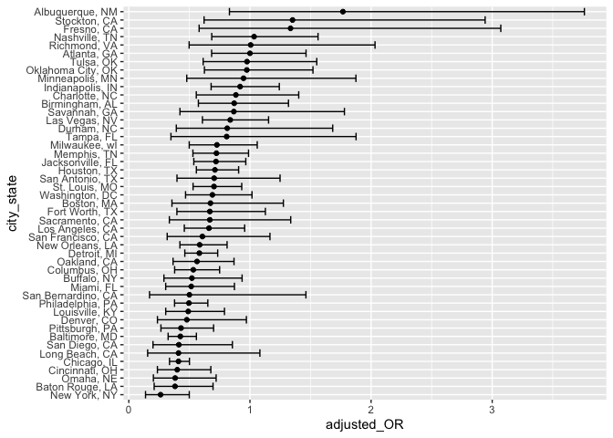
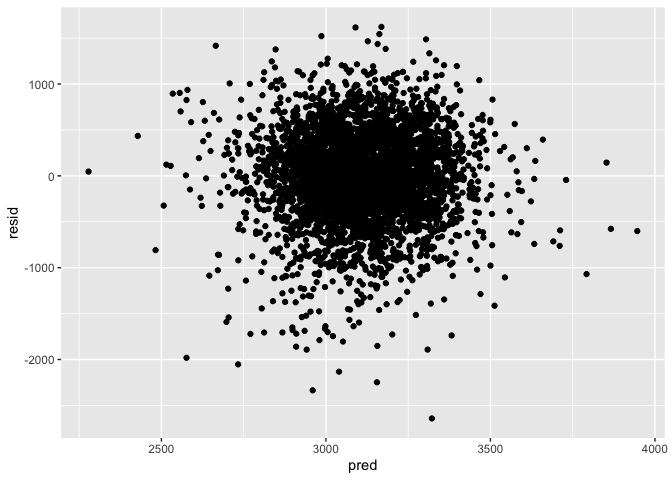
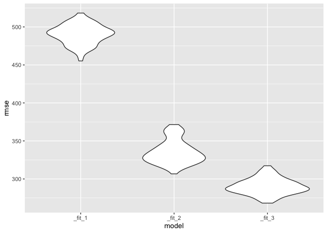

Homework 6
================
Lincole Jiang
2022-12-03

This is Lincole’s solution for Homework 6, P8105

### Problem 0

This problem stresses the adherence to the standards of this course
regarding repo structure, git commit history, and reproducibility.

### Problem 1

*omitted*

### Problem 2

For this problem, we use the dataset gathered by *The Washington Post*
on homocides in 50 large U.S. cities. In the first step of data
wrangling, we create a city_state variable (e.g., Baltimore, MD) and a
binary variable indicating whether the homocide is solved while omitting
rows in which the city states that don’t report victim race, i.e.,
Dallas, TX; Phoenix, AZ; and Kansas City, MO. Moreover, we limit our
analysis such that victim_race is either black or white. Finally, we
make sure that victim_age is numeric.

``` r
homicide_df <- read_csv("./data/homicide-data.csv") %>%
  mutate(city_state = paste(city, state, sep = ", "),
         victim_age = as.numeric(victim_age),
         resolved = as.numeric(disposition == "Closed by arrest")) %>%
  filter(city_state != "Dallas, TX" & 
           city_state != "Phoenix, AZ" & 
           city_state != "Kansas City, MO" &
           city_state != "Tulsa, AL" & 
           (victim_race == "White" | 
              victim_race == "Black"))
```

    ## Rows: 52179 Columns: 12
    ## ── Column specification ────────────────────────────────────────────────────────
    ## Delimiter: ","
    ## chr (9): uid, victim_last, victim_first, victim_race, victim_age, victim_sex...
    ## dbl (3): reported_date, lat, lon
    ## 
    ## ℹ Use `spec()` to retrieve the full column specification for this data.
    ## ℹ Specify the column types or set `show_col_types = FALSE` to quiet this message.

    ## Warning in mask$eval_all_mutate(quo): NAs introduced by coercion

Now, for the city of Baltimore, MD, we fit a logistic regression with
resolved vs. unsolved as the outcome and victim age, sex, and race as
predictors. Then, comparing male victims to female victims and keeping
all other variables fix, we obtain the estimate and confidence interval
of the adjusted odds ratio for solving homocides.

``` r
baltimore_df <- homicide_df %>% 
  filter(city_state == "Baltimore, MD") %>%
  select(victim_age, victim_sex, victim_race, resolved)

fit_logistic_bal = baltimore_df %>%
  glm(resolved ~ victim_age + victim_sex + victim_race, data = ., 
      family = binomial()) 

# Display the estimate and confidence interval of the adjusted odds ratio comparing male to female.
fit_logistic_bal %>% 
  broom::tidy() %>%
  filter(term == "victim_sexMale") %>%
  mutate(adjusted_OR = exp(estimate),
         lower_CI = exp(estimate - 1.96 * std.error),
         upper_CI = exp(estimate + 1.96 * std.error)) %>%
  select(term, adjusted_OR, lower_CI, upper_CI) %>%
  knitr::kable(digits = 3)
```

| term           | adjusted_OR | lower_CI | upper_CI |
|:---------------|------------:|---------:|---------:|
| victim_sexMale |       0.426 |    0.325 |    0.558 |

Now, we run log regression for each city in the dataset and exract the
adjusted odds ratio and CI for solving homocides comparing male victims
to female victims.

``` r
# Fit log function for each variable
fit_logistic <- homicide_df %>% 
  nest(data = -city_state) %>%
  mutate(
    fit = map(.x = data, ~ glm(resolved ~ victim_age + victim_sex + victim_race, data = ., family = binomial())),
    output = map(fit, broom::tidy)) %>%
  select(city_state, output) %>%
  unnest(cols = output) %>%
  filter(term == "victim_sexMale") %>%
  mutate(adjusted_OR = exp(estimate),
         lower_CI = exp(estimate - 1.96 * std.error),
         upper_CI = exp(estimate + 1.96 * std.error)) %>%
  select(city_state, adjusted_OR, lower_CI, upper_CI) 

# Display result
fit_logistic %>%
  knitr::kable(digits = 3)
```

| city_state         | adjusted_OR | lower_CI | upper_CI |
|:-------------------|------------:|---------:|---------:|
| Albuquerque, NM    |       1.767 |    0.831 |    3.761 |
| Atlanta, GA        |       1.000 |    0.684 |    1.463 |
| Baltimore, MD      |       0.426 |    0.325 |    0.558 |
| Baton Rouge, LA    |       0.381 |    0.209 |    0.695 |
| Birmingham, AL     |       0.870 |    0.574 |    1.318 |
| Boston, MA         |       0.674 |    0.356 |    1.276 |
| Buffalo, NY        |       0.521 |    0.290 |    0.935 |
| Charlotte, NC      |       0.884 |    0.557 |    1.403 |
| Chicago, IL        |       0.410 |    0.336 |    0.501 |
| Cincinnati, OH     |       0.400 |    0.236 |    0.677 |
| Columbus, OH       |       0.532 |    0.378 |    0.750 |
| Denver, CO         |       0.479 |    0.236 |    0.971 |
| Detroit, MI        |       0.582 |    0.462 |    0.734 |
| Durham, NC         |       0.812 |    0.392 |    1.683 |
| Fort Worth, TX     |       0.669 |    0.397 |    1.127 |
| Fresno, CA         |       1.335 |    0.580 |    3.071 |
| Houston, TX        |       0.711 |    0.558 |    0.907 |
| Indianapolis, IN   |       0.919 |    0.679 |    1.242 |
| Jacksonville, FL   |       0.720 |    0.537 |    0.966 |
| Las Vegas, NV      |       0.837 |    0.608 |    1.154 |
| Long Beach, CA     |       0.410 |    0.156 |    1.082 |
| Los Angeles, CA    |       0.662 |    0.458 |    0.956 |
| Louisville, KY     |       0.491 |    0.305 |    0.790 |
| Memphis, TN        |       0.723 |    0.529 |    0.988 |
| Miami, FL          |       0.515 |    0.304 |    0.872 |
| Milwaukee, wI      |       0.727 |    0.499 |    1.060 |
| Minneapolis, MN    |       0.947 |    0.478 |    1.875 |
| Nashville, TN      |       1.034 |    0.685 |    1.562 |
| New Orleans, LA    |       0.585 |    0.422 |    0.811 |
| New York, NY       |       0.262 |    0.138 |    0.499 |
| Oakland, CA        |       0.563 |    0.365 |    0.868 |
| Oklahoma City, OK  |       0.974 |    0.624 |    1.520 |
| Omaha, NE          |       0.382 |    0.203 |    0.721 |
| Philadelphia, PA   |       0.496 |    0.378 |    0.652 |
| Pittsburgh, PA     |       0.431 |    0.265 |    0.700 |
| Richmond, VA       |       1.006 |    0.498 |    2.033 |
| San Antonio, TX    |       0.705 |    0.398 |    1.249 |
| Sacramento, CA     |       0.669 |    0.335 |    1.337 |
| Savannah, GA       |       0.867 |    0.422 |    1.780 |
| San Bernardino, CA |       0.500 |    0.171 |    1.462 |
| San Diego, CA      |       0.413 |    0.200 |    0.855 |
| San Francisco, CA  |       0.608 |    0.317 |    1.165 |
| St. Louis, MO      |       0.703 |    0.530 |    0.932 |
| Stockton, CA       |       1.352 |    0.621 |    2.942 |
| Tampa, FL          |       0.808 |    0.348 |    1.876 |
| Tulsa, OK          |       0.976 |    0.614 |    1.552 |
| Washington, DC     |       0.690 |    0.468 |    1.017 |

Finally, we create a plot that shows the estimated ORs and CIs for each
city with cities organized according to the estimated OR.

``` r
fit_logistic %>%
  mutate(city_state = fct_reorder(city_state, adjusted_OR)) %>%
  ggplot(aes(x = city_state, y = adjusted_OR, ymin = lower_CI, ymax = upper_CI)) +
  geom_point() + 
  geom_errorbar() +
  coord_flip() +
  theme(legend.position = "none")
```

<!-- -->

### Problem 3

In this problem, we analyze the potential effects on a child’s
birthweight using a dataset consisted roughly of 4000 children. We first
load and clean the data to set it up for regression analysis.
Specifically, we change variable sex of baby, father’s race, and
mother’s race into factor variables.

``` r
birthweight_df <- read_csv("./data/birthweight.csv") %>% 
  mutate(babysex = as.factor(case_when(babysex == 1 ~ "male",
                                       babysex == 2 ~ "female")),
         frace = as.factor(case_when(frace == 1 ~ "White",
                                     frace == 2 ~ "Black",
                                     frace == 3 ~ "Asian",
                                     frace == 4 ~ "Puerto Rican",
                                     frace == 8 ~ "Other",
                                     frace == 9 ~ "Uknown")),
         mrace = as.factor(case_when(frace == 1 ~ "White",
                                     frace == 2 ~ "Black",
                                     frace == 3 ~ "Asian",
                                     frace == 4 ~ "Puerto Rican",
                                     frace == 8 ~ "Other")))
```

    ## Rows: 4342 Columns: 20
    ## ── Column specification ────────────────────────────────────────────────────────
    ## Delimiter: ","
    ## dbl (20): babysex, bhead, blength, bwt, delwt, fincome, frace, gaweeks, malf...
    ## 
    ## ℹ Use `spec()` to retrieve the full column specification for this data.
    ## ℹ Specify the column types or set `show_col_types = FALSE` to quiet this message.

Now, we propose a model of based on hypothesis testing. To build my own
model, I want to look at the factors that affect pregnancy and whether
these factors play roles in determining the birthweight of the baby;
namely, family monthly income, average number of cigarettes smoked per
day during pregnancy, and mother’s weight gain during pregnancy and all
interactions. We then plot the model residuals against fitted values.

``` r
# Fit regression model
fit_1 = birthweight_df %>% lm(bwt ~ fincome * smoken * wtgain, data = .)

# Plot model residuals against fitted values
birthweight_df %>% 
  add_predictions(fit_1) %>%
  add_residuals(fit_1) %>% 
  ggplot(aes(x = pred, y = resid)) +
  geom_point()
```

<!-- -->

We can clearly see from this residual vs. fited plot that: 1. The
residuals do not bounce randomly around the 0 line but concentrate
around when fitted value = 3100, suggesting that linearity is not a
reasonable hypothesis; 2. The residuals roughly form a “horizontal band”
around the 0 line, suggesting that the variances of error terms are
equal; 3. There are several outliers in the plot.

Next, we build the other two models by which we compare our model: one
using length at birth and gestational age as predictors considering only
main effects; and the other one using head circumference, length, sex,
all interactions including the three-way interaction between these three
explanatory variables. We then make the comparison in terms of the
cross-validated prediction error.

``` r
cv_df <- crossv_mc(birthweight_df, n = 100) %>%
  mutate(
    train = map(train, as_tibble),
    test = map(test, as_tibble)) %>% 
  mutate(
    fit_1 = map(train, ~lm(bwt ~ fincome * smoken * wtgain, data = .x)),
    fit_2 = map(train, ~lm(bwt ~ blength + gaweeks, data = .x)),
    fit_3 = map(train, ~lm(bwt ~ bhead * blength * babysex, data = .x))
  ) %>%
  mutate(
    rmse_fit_1 = map2_dbl(fit_1, test, ~rmse(model = .x, data = .y)),
    rmse_fit_2 = map2_dbl(fit_2, test, ~rmse(model = .x, data = .y)),
    rmse_fit_3 = map2_dbl(fit_3, test, ~rmse(model = .x, data = .y))
  )

# Display RMSE results
cv_df %>% 
  summarise(fit1_mean_error = mean(rmse_fit_1),
            fit2_mean_error = mean(rmse_fit_2),
            fit3_mean_error = mean(rmse_fit_3)) %>%
  knitr::kable(digits = 3)
```

| fit1_mean_error | fit2_mean_error | fit3_mean_error |
|----------------:|----------------:|----------------:|
|         490.103 |          335.35 |         290.181 |

``` r
# Show the distribution of RMSEs using violin plots
cv_df %>%
  select(starts_with("rmse")) %>%
  pivot_longer(
    everything(),
    names_to = "model",
    values_to = "rmse",
    names_prefix = "rmse") %>%
  mutate(model = fct_inorder(model)) %>%
  ggplot(aes(x = model, y = rmse)) + 
  geom_violin()
```

<!-- -->
